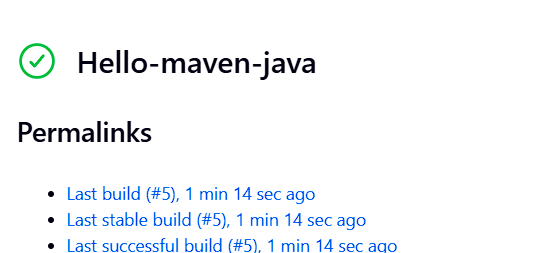
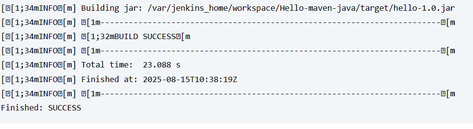

# Hello Java Maven Jenkins Project
This project builds a simple Java app using Maven in Jenkins.

## Steps Performed
1. Created HelloWorld Java program
2. Created `pom.xml`
3. Configured Maven in Jenkins
4. Created and ran a Freestyle job

## Output

